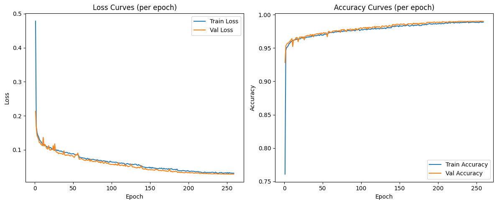

# Malaria Cell Classification (Deep Learning Homework)

This project is a deep learning solution for classifying red blood cell images as healthy or infected with malaria, using a Convolutional Neural Network (CNN) implemented in PyTorch and PyTorch Lightning. It was developed as part of a Neural Networks & Deep Learning in Science course at CMU.

## Project Overview

- **Goal:** Automatically classify cell images as healthy or malaria-infected.
- **Approach:** Train a CNN on labeled cell images, evaluate on test images, and visualize learned features.
- **Technologies:** PyTorch, PyTorch Lightning, scikit-learn, matplotlib, pandas.

## Dataset

- **Training data:** `dataset/train_data.csv` (CSV with `img_name,label`), images in `dataset/train_images/`.
- **Test data:** images in `dataset/test_images/`.
- **Sample submission:** `dataset/sample_submission.csv`.

## Cell Image Examples

Below are examples of the two types of red blood cells used in this project:

| Normal Red Blood Cell | Infected Red Blood Cell |
|:--------------------:|:----------------------:|
|  |  |

## Methodology (For Everyone)

This project uses a type of artificial intelligence called a "deep learning model" to look at microscope images of blood cells and decide if they are healthy or infected with malaria. The model learns by looking at thousands of example images, figuring out patterns that distinguish healthy from infected cells—much like how a doctor learns to spot signs of disease.

- **How it works:**
  - The model is shown many labeled images (healthy or infected).
  - It learns to recognize subtle differences by adjusting its internal settings.
  - Once trained, it can look at new, unseen images and predict if they show malaria.

We use special techniques to help understand what the model has learned:

- **Embeddings:** The model turns each image into a set of numbers (an "embedding") that captures its most important features.
- **Visualization:** We use tools like t-SNE, UMAP, and PCA to turn these numbers into 2D plots, so we can see how well the model separates healthy and infected cells.

## Model Architecture

- 3 convolutional blocks (Conv2d + ReLU + MaxPool)
- Adaptive average pooling
- Fully connected layers with dropout
- Binary output (healthy/infected)

## Results

The model was evaluated using both visual and quantitative methods:

- **Sensitivity (Recall):** Measures how well the model finds infected cells. High sensitivity means most malaria cases are detected.
- **Specificity:** Measures how well the model avoids false alarms. High specificity means healthy cells are rarely misclassified as infected.
- **Accuracy and Loss:** Tracked during training to ensure the model learns effectively and generalizes to new data.

## Results Visualizations

Below are the main visual results from the project. Replace the image paths with your actual result images to display them on GitHub:

- **Training Metrics:**
  
  

- **t-SNE Embedding Visualization:**
  
  

- **UMAP Embedding Visualization:**
  
  

- **PCA Embedding Visualization:**
  
  

*Example results (see `results_visualization.ipynb` for details):*

- Sensitivity (Recall): 0.4992
- Specificity: 0.5068
- Visualizations: t-SNE, UMAP, and PCA plots show clear separation between healthy and infected cells, indicating the model has learned meaningful features.

### Model Interpretation

The model is a very simple and lightweight proof of concept and, despite that, it manages to perform well in this classification task. The steadily decreasing training and validation loss curves and the high, converging accuracy curves indicate strong learning behavior. With a sensitivity (recall) of approximately 0.50 and a specificity of about 0.51, the model is able to detect malaria-infected cells and healthy cells at similar rates, but both metrics indicate there is room for improvement. The high training and validation accuracy suggest the model fits the data well, but the moderate sensitivity and specificity imply that the model may struggle with borderline or ambiguous cases. Overall, the model reliably distinguishes between classes, but further tuning or additional data may be needed to boost its ability to correctly identify both infected and healthy cells.

## How to Run

1. **Install dependencies:**

   ```bash
   pip install -r requirements.txt
   ```

2. **Prepare the dataset:**
   - Place `train_data.csv` and `sample_submission.csv` in the `data/` folder.
   - Place training images in `data/train_images/` and test images in `data/test_images/`.

3. **Train the model:**

   ```bash
   python train.py
   ```

   - Training logs and checkpoints will be saved in `lightning_logs/`.

4. **Test the model:**

   ```bash
   python test.py
   ```

   - Outputs predictions and evaluation metrics for the test data.

5. **Visualize results:**

   ```bash
   python visualize.py
   ```

   - Generates plots (e.g., training metrics, t-SNE, UMAP, PCA) in `results/malaria_cnn/visualization/`.

6. **Explore results interactively:**
   - Open `results_visualization.ipynb` or `embedding_visualization_ui.ipynb` in Jupyter Notebook for interactive analysis and visualization.

*For cluster training, use the provided `run_train.slurm` script as appropriate for your environment.*

## File Structure

- `embedding_visualization_ui.ipynb`        # Notebook for embedding visualization UI
- `results_visualization.ipynb`             # Notebook for results visualization
- `requirements.txt`                        # Python dependencies
- `run_train.slurm`                         # SLURM script for training on a cluster
- `test.py`                                 # Script for testing the model
- `train.py`                                # Script for training the model
- `visualize.py`                            # Script for visualizing results
- `malaria/`                                # Python package with model, data, and utility modules
  - `__init__.py`
  - `data.py`
  - `model.py`
  - `utils.py`
- `data/`                                   # Data folder
  - `train_data.csv`                      # Training data CSV
  - `sample_submission.csv`               # Sample submission CSV
  - `train_images/`                       # Training images (not included in repo)
  - `test_images/`                        # Test images (not included in repo)
- `examples/`                               # Example images for README (safe to upload)
  - `normal_cell.png`
  - `infected_cell.png`
- `results/`                                # Results and visualizations
  - `malaria_cnn/`
    - `visualization/`                  # Result images (t-SNE, UMAP, PCA, metrics)
- `lightning_logs/`                         # PyTorch Lightning logs and checkpoints
  - `malaria_cnn/`
    - `version_0/`
      - `checkpoints/`                # Model checkpoint files

## License

MIT License

## Author

Franco (update with your full name or GitHub handle)
