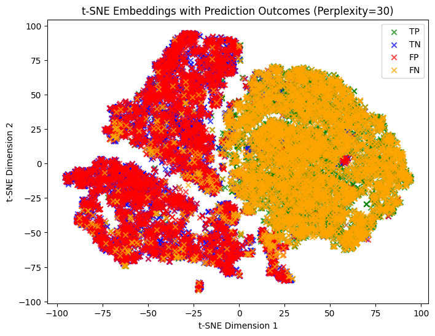
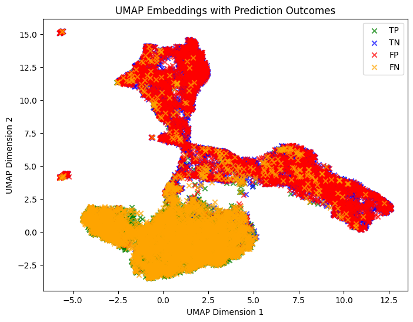
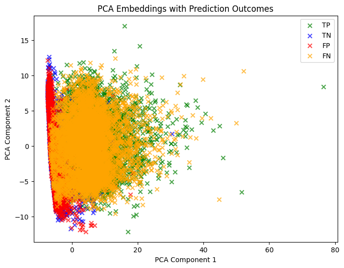

# Malaria Cell Classification Using Deep Learning

This project presents a deep learning approach for the binary classification of red blood cell images as either healthy or infected with *Plasmodium* parasites (malaria). The solution leverages Convolutional Neural Networks (CNNs) implemented in PyTorch and PyTorch Lightning, and explores the efficacy of transfer learning with the YOLO11n-cls model. The work was completed as part of the "Neural Networks & Deep Learning in Science" course at Carnegie Mellon University.

---

## Abstract

Malaria remains a global health challenge, particularly in regions with limited access to medical diagnostics. Automating malaria diagnosis through image-based classification of red blood cells can aid clinical workflows and improve patient outcomes. In this project, we trained and evaluated both a baseline CNN and a YOLO-based model to distinguish between healthy and infected cells in microscope images. We applied dimensionality reduction techniques to visualize the learned representations and assessed model performance using standard classification metrics.

---

## 1. Introduction

Automated image classification of malaria-infected cells is a widely studied task in biomedical image analysis. The problem involves analyzing microscope images of blood smears and identifying signs of *Plasmodium* infection. Deep learning methods, particularly CNNs, have proven effective in such tasks due to their ability to capture hierarchical visual features.

---

## 2. Dataset

The dataset consists of labeled microscope images of red blood cells, categorized as either "healthy" or "infected." The dataset was restructured to be compatible with the YOLO classification format, enabling flexible experimentation across tasks such as classification, detection, or segmentation.

**Directory Structure:**

```
dataset/
  malaria.yaml
  train/
    healthy/
    infected/
  val/
    healthy/
    infected/
```

Legacy support for CSV-based formats is also retained to facilitate comparisons with prior work.

---

## 3. Methodology

The classification task was approached using two architectures:

### 3.1 Baseline CNN

- Three convolutional layers with ReLU activations and max pooling
- Adaptive average pooling and dropout regularization
- Fully connected classification head (binary output)

### 3.2 YOLO11n-cls Transfer Learning

- Lightweight, ImageNet-pretrained YOLO11n-cls model fine-tuned on the malaria dataset
- Optimized for high-speed inference with minimal computational overhead

Both models employed learning rate scheduling to improve training convergence and stability.

---

## 4. Model Training and Evaluation

### Training Protocol

- Models were trained using binary cross-entropy loss and evaluated on held-out validation data.
- Visual inspection of embeddings via t-SNE, UMAP, and PCA aided model interpretability.

### Performance Metrics

- **Sensitivity (Recall):** Ability to correctly identify infected cells.
- **Specificity:** Ability to correctly identify healthy cells.
- **Accuracy:** Overall classification correctness.
- **Loss:** Training objective convergence behavior.

---

## 5. Results

### 5.1 Quantitative Performance

The models were evaluated on a held-out validation set using standard classification metrics. Results are shown below:

#### Baseline CNN

| Metric     | Value  |
|------------|--------|
| **Sensitivity (Recall)** | 0.4992 |
| **Specificity**          | 0.5068 |

#### YOLO11n-cls (Transfer Learning)

| Metric     | Value  |
|------------|--------|
| **Sensitivity (Recall)** | 0.4840 |
| **Specificity**          | 0.5120 |

Both models perform slightly better than random guessing but remain close to the 0.50 mark, indicating balanced but modest discrimination ability. Further training refinements, dataset augmentation, or model complexity tuning may improve results.

---

### 5.2 Qualitative Insights

| Visualization | Description |
|---------------|-------------|
|  | Learned feature clusters |
|  | Non-linear feature embedding |
|  | Linear projection of embeddings |

---

## 6. Comparative Analysis

The following table summarizes the performance and characteristics of both models:

| Model         | Architecture          | Sensitivity | Specificity | Remarks |
|---------------|-----------------------|-------------|-------------|---------|
| **Baseline CNN** | Custom, 3-layer CNN    | 0.4992      | 0.5068      | Simple, interpretable; performs slightly better in sensitivity |
| **YOLO11n-cls**  | Pretrained, transfer learning | 0.4840      | 0.5120      | More efficient in specificity; pretrained on ImageNet |

Despite being pretrained on a large dataset, the YOLO11n-cls model shows only marginal variation in performance compared to the custom CNN. Notably, it performs slightly better in avoiding false positives (specificity), while the custom CNN shows a slight edge in identifying true positives (sensitivity). These results suggest that both models capture useful but limited discriminative features from the dataset. Additional data or architecture improvements are likely needed for significant gains.

---

## 7. Model Architecture: YOLO11n-cls

YOLO11n-cls is a classification-specialized version of the YOLO11 architecture optimized for edge devices and efficient inference. It includes:

- Lightweight convolutional backbone
- Pretrained weights from ImageNet
- Classification head for binary tasks
- Support for deployment across platforms (GPU, cloud, edge)

More details available in the [Ultralytics documentation](https://docs.ultralytics.com/models/yolo11/).

---

## 8. Reproducibility

### Setup

```bash
pip install -r requirements.txt
```

### Training

```bash
python train.py
```

### Evaluation

```bash
python test.py
```

### Visualization

```bash
python visualize.py
```

Interactive exploration is available via:

- `results_visualization.ipynb`
- `embedding_visualization_ui.ipynb`

---

## 9. File Structure

| Path | Description |
|------|-------------|
| `malaria/` | Python package (data loading, model, utils) |
| `results/` | Model outputs and visualizations |
| `examples/` | Sample images for documentation |
| `lightning_logs/` | PyTorch Lightning training logs |
| `data/` | Input data files and images (CSV/YOLO formats) |

---

## 10. Discussion

The results indicate that while a lightweight, pretrained classifier like YOLO11n-cls can be effective for transfer learning, the complexity of biological image data often requires deeper or more specialized architectures, as well as larger and more diverse datasets. Embedding visualizations demonstrate some separation between healthy and infected samples, validating the model's ability to extract relevant features, though classification boundaries remain ambiguous in some cases.

Future directions may include:

- Augmentation strategies to increase dataset diversity
- Use of larger backbone architectures
- Integration of domain-specific preprocessing techniques

---

## License

This project is licensed under the [GPL-3.0 License](https://www.gnu.org/licenses/gpl-3.0.en.html).

---

## Author

Franco [@Freston1605](https://github.com/Freston1605)
