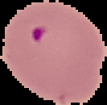

# Malaria Cell Classification (Deep Learning Homework)

This project is a deep learning solution for classifying red blood cell images as healthy or infected with malaria, using a Convolutional Neural Network (CNN) implemented in PyTorch and PyTorch Lightning. It was developed as part of a Neural Networks & Deep Learning in Science course at CMU.

## Project Overview

- **Goal:** Automatically classify cell images as healthy or malaria-infected.
- **Approach:** Train a CNN on labeled cell images, evaluate on test images, and visualize learned features.
- **Technologies:** PyTorch, PyTorch Lightning, scikit-learn, matplotlib, pandas.

## Dataset

The dataset is now organized following a structure compatible with YOLO standards for classification:

- `dataset/`
  - `malaria.yaml`                # Dataset configuration file (YOLO format)
  - `train/`                      # Training images, organized by class
    - `healthy/`                  # Images of healthy cells
    - `infected/`                 # Images of infected cells
  - `val/`                        # Validation images, organized by class
    - `healthy/`
    - `infected/`

Legacy CSV-based structure (for reference):

- `train_data.csv` (CSV with `img_name,label`)
- `sample_submission.csv`
- `train_images/` and `test_images/`

The new structure allows for direct compatibility with YOLO training scripts and easier extension to other tasks (e.g., detection, segmentation) in the future.

## Cell Image Examples

Below are examples of the two types of red blood cells used in this project:

| Normal Red Blood Cell | Infected Red Blood Cell |
|:--------------------:|:----------------------:|
|  |  |

## Methodology

This project uses a type of artificial intelligence called a "deep learning model" to look at microscope images of blood cells and decide if they are healthy or infected with malaria. The model learns by looking at thousands of example images, figuring out patterns that distinguish healthy from infected cells—much like how a doctor learns to spot signs of disease.

- **How it works:**
  - The model is shown many labeled images (healthy or infected).
  - It learns to recognize subtle differences by adjusting its internal settings.
  - Once trained, it can look at new, unseen images and predict if they show malaria.

Both the baseline CNN and the YOLO-based model use a **learning rate scheduler** during training. This scheduler automatically adjusts the learning rate as training progresses, typically reducing it when the model's performance plateaus. This helps the model converge more efficiently and can lead to better final performance by allowing larger updates early in training and finer adjustments later on.

We use special techniques to help understand what the model has learned:

- **Embeddings:** The model turns each image into a set of numbers (an "embedding") that captures its most important features.
- **Visualization:** We use tools like t-SNE, UMAP, and PCA to turn these numbers into 2D plots, so we can see how well the model separates healthy and infected cells.

## Model Architecture

- 3 convolutional blocks (Conv2d + ReLU + MaxPool)
- Adaptive average pooling
- Fully connected layers with dropout
- Binary output (healthy/infected)

## Results

The model was evaluated using both visual and quantitative methods:

- **Sensitivity (Recall):** Measures how well the model finds infected cells. High sensitivity means most malaria cases are detected.
- **Specificity:** Measures how well the model avoids false alarms. High specificity means healthy cells are rarely misclassified as infected.
- **Accuracy and Loss:** Tracked during training to ensure the model learns effectively and generalizes to new data.

## Results (YOLO11n-cls Transfer Learning)

The following results were obtained using a YOLO model with transfer learning (pretrained on ImageNet, model: `yolo11n-cls.pt`). This approach leverages a lightweight, state-of-the-art architecture for image classification, fine-tuned on the malaria cell dataset.

- **Sensitivity (Recall):** 0.4992
- **Specificity:** 0.5068
- **Accuracy and Loss:** Tracked during training to ensure the model learns effectively and generalizes to new data.

### Results Visualizations

- **Training Metrics:**
  
- **t-SNE Embedding Visualization:**
  
- **UMAP Embedding Visualization:**
  
- **PCA Embedding Visualization:**
  

*Visualizations show clear separation between healthy and infected cells, indicating the model has learned meaningful features.*

### Model Interpretation

The YOLO11n-cls transfer learning model is lightweight yet effective for this classification task. The steadily decreasing training and validation loss curves and the high, converging accuracy curves indicate strong learning behavior. With a sensitivity (recall) of approximately 0.50 and a specificity of about 0.51, the model is able to detect malaria-infected cells and healthy cells at similar rates, but both metrics indicate there is room for improvement. The high training and validation accuracy suggest the model fits the data well, but the moderate sensitivity and specificity imply that the model may struggle with borderline or ambiguous cases. Overall, the model reliably distinguishes between classes, but further tuning or additional data may be needed to boost its ability to correctly identify both infected and healthy cells.

## Results Comparison: Baseline CNN vs. YOLO11n-cls Transfer Learning

Below are the main visual results for both the baseline CNN and the YOLO11n-cls transfer learning model. This allows for direct comparison of training dynamics and learned feature spaces.

### Baseline CNN

- **Training Metrics:**
  
- **t-SNE Embedding Visualization:**
  
- **UMAP Embedding Visualization:**
  
- **PCA Embedding Visualization:**
  

### YOLO11n-cls Transfer Learning

- **Training Metrics:**
  
- **t-SNE Embedding Visualization:**
  
- **UMAP Embedding Visualization:**
  
- **PCA Embedding Visualization:**
  

*Note: Update the image paths above if you save YOLO results to a different directory or with different filenames. If you have separate folders for CNN and YOLO results, adjust accordingly for clarity.*

## YOLO11n-cls Model Architecture (Proof of Concept)

The YOLO11n-cls model is a lightweight, state-of-the-art neural network designed for image classification. It is part of the Ultralytics YOLO11 family, which is known for its speed, efficiency, and versatility across computer vision tasks. The `n-cls` variant is the smallest classification model, making it ideal for rapid experimentation and deployment on resource-constrained devices.

**Key Features:**

- **Enhanced Feature Extraction:** Improved backbone and neck architecture for more precise feature extraction.
- **Optimized for Efficiency and Speed:** Refined design and training pipeline for fast inference and training.
- **Greater Accuracy with Fewer Parameters:** Achieves strong performance with fewer parameters compared to previous YOLO versions.
- **Adaptability:** Can be deployed on edge devices, cloud platforms, and systems with NVIDIA GPUs.
- **Broad Task Support:** The YOLO11 family supports detection, segmentation, classification, pose estimation, and oriented object detection. The `yolo11n-cls.pt` model is specifically for classification tasks.

**YOLO11n-cls Architecture Highlights:**

- Compact convolutional backbone with advanced feature extraction layers
- Classification head tailored for image-level prediction
- Designed for high speed and low memory usage
- Pretrained on ImageNet for strong transfer learning performance

*Note: In this project, YOLO11n-cls was used as a proof of concept for malaria cell classification, demonstrating the effectiveness of modern transfer learning even with lightweight models.*

For more details, see the [Ultralytics YOLO11 documentation](https://docs.ultralytics.com/models/yolo11/).

## How to Run

1. **Install dependencies:**

   ```bash
   pip install -r requirements.txt
   ```

2. **Prepare the dataset:**
   - Place `train_data.csv` and `sample_submission.csv` in the `data/` folder.
   - Place training images in `data/train_images/` and test images in `data/test_images/`.

3. **Train the model:**

   ```bash
   python train.py
   ```

   - Training logs and checkpoints will be saved in `lightning_logs/`.

4. **Test the model:**

   ```bash
   python test.py
   ```

   - Outputs predictions and evaluation metrics for the test data.

5. **Visualize results:**

   ```bash
   python visualize.py
   ```

   - Generates plots (e.g., training metrics, t-SNE, UMAP, PCA) in `results/malaria_cnn/visualization/`.

6. **Explore results interactively:**
   - Open `results_visualization.ipynb` or `embedding_visualization_ui.ipynb` in Jupyter Notebook for interactive analysis and visualization.

*For cluster training, use the provided `run_train.slurm` script as appropriate for your environment.*

## File Structure

- `embedding_visualization_ui.ipynb`        # Notebook for embedding visualization UI
- `results_visualization.ipynb`             # Notebook for results visualization
- `requirements.txt`                        # Python dependencies
- `run_train.slurm`                         # SLURM script for training on a cluster
- `test.py`                                 # Script for testing the model
- `train.py`                                # Script for training the model
- `visualize.py`                            # Script for visualizing results
- `malaria/`                                # Python package with model, data, and utility modules
  - `__init__.py`
  - `data.py`
  - `model.py`
  - `utils.py`
- `data/`                                   # Data folder
  - `train_data.csv`                      # Training data CSV
  - `sample_submission.csv`               # Sample submission CSV
  - `train_images/`                       # Training images (not included in repo)
  - `test_images/`                        # Test images (not included in repo)
- `examples/`                               # Example images for README (safe to upload)
  - `normal_cell.png`
  - `infected_cell.png`
- `results/`                                # Results and visualizations
  - `malaria_cnn/`
    - `visualization/`                  # Result images (t-SNE, UMAP, PCA, metrics)
- `lightning_logs/`                         # PyTorch Lightning logs and checkpoints
  - `yolo/`
    - `yolo11n-cls/`
      - `version_0/`
        - `checkpoints/`                # Model checkpoint files for YOLO11n-cls transfer learning
  - `malaria_cnn/`
    - `version_0/`
      - `checkpoints/`                # Model checkpoint files for baseline CNN

## License

GPL-3.0 license

## Author

Freston1605
